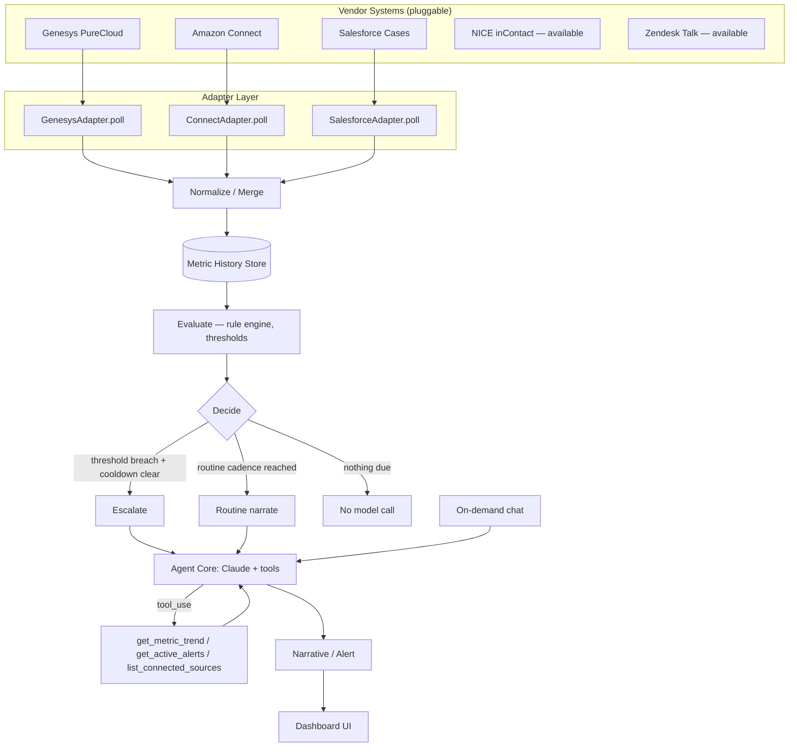

# Signal — Contact Center Insights Agent
### Architecture Overview

A live, always-on agent that unifies contact center telemetry from multiple vendor
systems into one narrative, escalates proactively when something crosses a
threshold, and answers follow-up questions on demand — reasoning transparently
about when to call the model at all.

---

## 1. The problem this solves

Contact centers routinely run three or more disconnected systems — a telephony/ACD
platform (Genesys, Amazon Connect, NICE), a CRM/case system (Salesforce, Zendesk),
and sometimes a separate QA or WFM tool. Each shows its own dashboard. Nobody has
one real-time picture, and nobody is proactively told when something's wrong until
a client or an SLA report says so. That gap — multiple sources, no unified
real-time insight, no proactive alerting — is the recurring pain point this agent
is built around.

## 2. System diagram



## 3. The adapter contract

Every data source — real or mock — implements the same interface, so the agent
core never knows or cares which vendor it's talking to:

```js
{
  id: "genesys",
  label: "Genesys PureCloud",
  status: "connected",
  poll: async () => ({
    source: "genesys",
    timestamp: "2026-07-25T09:14:00Z",
    metrics: { sla: 91.2, aht: 244 }   // partial — only what this source owns
  })
}
```

Swapping mock data for production data means writing a new `poll()` that calls
the real API (Genesys Cloud Analytics API, Amazon Connect real-time metrics,
Salesforce Service Cloud / Einstein sentiment) and returns the same shape.
Nothing downstream changes. This mirrors the integration pattern used for iPaaS
connectors — one normalized contract, many source-specific implementations.

## 4. The agent loop

Each cycle runs four stages, logged transparently in the UI's activity log:

1. **Observe** — poll all connected adapters in parallel, merge their partial
   snapshots into one unified metric point, append to history.
2. **Evaluate** — a lightweight rule engine checks each metric against its
   warn/critical thresholds. This step never calls the model — it's cheap,
   deterministic, and instant.
3. **Decide** — the agent chooses one of three actions:
   - **Escalate**: a threshold was breached and the cooldown window has
     elapsed → call the model with an "escalation" framing.
   - **Routine narrate**: no breach, but the routine cadence (every N cycles)
     is due → call the model for a scheduled update.
   - **Idle**: nothing is due → skip the model call entirely.
4. **Act** — update the dashboard: new narrative text, an alert banner, or
   nothing.

This "don't call the LLM every tick" design is a deliberate cost/latency
control — worth calling out explicitly in an interview, since it shows
awareness that agents calling a model on every poll is expensive and noisy in
production.

## 5. Tool use (real function calling)

The narrative and chat calls aren't just prompt-stuffed with data — Claude is
given actual tools and decides for itself whether it needs more context:

| Tool | Purpose |
|---|---|
| `get_metric_trend` | Pull a longer history window for one metric to assess direction/volatility |
| `get_active_alerts` | Check what's currently flagged before answering |
| `list_connected_sources` | Confirm which systems are feeding the agent |

When Claude calls a tool, the app executes it locally against in-memory state
and returns the result, and Claude continues reasoning — a genuine
observe → reason → act loop, not a single prompt/response round-trip.

## 6. On-demand vs. autonomous

The same agent core serves both modes:
- **Autonomous**: the loop above runs continuously and decides for itself when
  to speak up.
- **On-demand**: a user question goes straight into `runAgentTurn()` with the
  current snapshot and full tool access, so answers stay grounded in live data
  rather than the model's general knowledge.

## 7. What's mocked vs. what maps directly to production

| Component | In this demo | In production |
|---|---|---|
| Adapters | Simulated state, same interface | Real Genesys / Amazon Connect / Salesforce SDKs or REST calls |
| Alert delivery | UI banner | Twilio (SMS) / SendGrid (email) / Slack webhook |
| History store | In-memory array | Time-series store (e.g. TimescaleDB, DynamoDB with TTL) |
| Agent scheduling | `setInterval` in the browser | Serverless cron / queue worker (e.g. EventBridge + Lambda) |
| Tool execution | Local JS functions | Same contract, backed by real queries |

---

### How to talk about this in an interview

- "I unified three vendor data sources behind one normalized contract, the same
  pattern I use for iPaaS integrations at eMite."
- "The agent doesn't call the model on every poll — it evaluates deterministically
  first and only reasons with Claude when something's actually decision-worthy."
- "I gave it real tool access rather than just stuffing context into the prompt,
  so it pulls exactly the history it needs to explain an anomaly."
- "The adapter layer means swapping in a live Genesys or Amazon Connect
  credential doesn't touch the agent core at all."
